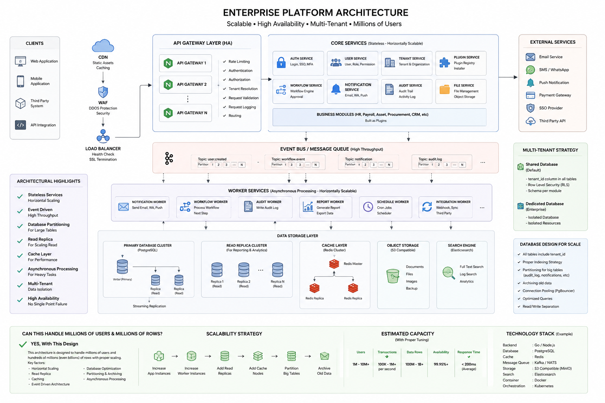

# ESSK Specs - Enterprise Platform Architecture Roadmap

## Purpose

This document defines the target architecture roadmap for evolving ESSK from an enterprise SaaS starter kit into an enterprise platform foundation.

The architecture reference is the provided "Enterprise Platform Architecture" diagram, stored locally at:

```text
specs/architecture.png
```

This diagram is the main long-term architecture reference for platform direction, scalability planning, service boundaries, and infrastructure evolution.



## Current Position

ESSK is currently moving in the correct direction, but it is still an early enterprise starter kit rather than a full enterprise platform.

Current strengths:

- Modular backend foundation using Go and Fiber.
- Modular frontend direction using Next.js App Router, `features`, and `shared`.
- PostgreSQL and Redis local infrastructure.
- Authentication, tenant management, user management, role management, RBAC, and product sample module.
- Seeded default tenants, roles, and users.
- Redis-backed rate limiting foundation.
- Audit field conventions and soft delete conventions.
- Docker Compose based local environment.
- Pre-commit and enterprise rule specifications.
- Initial enterprise readiness, security, testing, and scaffolding specifications.

Current maturity level:

```text
Starter Kit Foundation:        Strong
Enterprise Modularity:         In Progress
Enterprise Platform Runtime:   Early
High Availability:             Not Implemented
Event-Driven Platform:         Not Implemented
Large-Scale Data Strategy:     Not Implemented
Kubernetes Production Model:   Not Implemented
```

## Target Architecture Principles

The platform must evolve toward these principles:

- Stateless horizontally scalable application services.
- Multi-tenant by default.
- API-first contracts.
- Security enforced at gateway, service, and database layers.
- Event-driven processing for heavy, slow, or cross-module workflows.
- Strong auditability for administrative and sensitive actions.
- Consistent module scaffolding for backend, frontend, database, permissions, audit events, and tests.
- Clear separation between synchronous API workloads and asynchronous worker workloads.
- Production-ready observability.
- Database scalability through indexing, partitioning, read replicas, connection pooling, and archiving.
- Kubernetes-ready deployment for high availability.
- Modular monolith first, microservice extraction only when domain boundaries and scale justify it.

## Architecture Gap Analysis

| Target Layer | Current State | Gap |
| --- | --- | --- |
| Clients | Web app exists | No mobile app, public SDK, or third-party API client |
| CDN | Not implemented | Static asset CDN and caching strategy are missing |
| WAF | Not implemented | WAF rules and DDoS protection are missing |
| Load Balancer | Not implemented for production | No HA load balancing model |
| API Gateway | Not implemented as a real gateway | Routing, request validation, API key handling, gateway auth, and tenant resolution are not centralized |
| Core Services | Modular monolith exists | Service boundaries are not yet formalized for auth, user, tenant, plugin, workflow, notification, audit, and file services |
| Business Modules | Product sample exists | Business module plugin model is not implemented |
| Event Bus | Not implemented | Kafka or NATS, topics, partitions, retries, and DLQ are missing |
| Workers | Not implemented | Notification, workflow, audit, report, schedule, and integration workers are missing |
| Primary Database | PostgreSQL exists | No production cluster, PgBouncer, read replica, partitioning, or RLS enforcement |
| Read Replicas | Not implemented | No read/write split or reporting replica strategy |
| Cache Layer | Redis exists | Redis is used mainly as infrastructure; module-level cache policy is missing |
| Object Storage | Not implemented | File service and S3-compatible storage are missing |
| Search Engine | Not implemented | Elasticsearch or OpenSearch integration is missing |
| Multi-Tenant Strategy | Shared database foundation exists | RLS, tenant resolver, tenant-aware API keys, and dedicated enterprise database option are missing |
| External Services | Not implemented | Email, SMS, WhatsApp, push, payment, SSO, and third-party API adapters are missing |
| Observability | Minimal structured logging | OpenTelemetry, metrics, tracing, dashboards, and alerting are missing |
| Kubernetes | Not implemented | Helm, HPA, rolling deployment, readiness, liveness, and production secrets are missing |

## Recommended Evolution Strategy

ESSK should not immediately split into many microservices. The recommended path is:

```text
Modular Monolith
  -> Modular Monolith with Gateway
  -> Modular Monolith with Event Bus and Workers
  -> Platform Services for Shared Capabilities
  -> Selective Microservice Extraction
  -> Kubernetes HA Platform
```

This keeps the starter kit maintainable while still preparing the architecture for high scale.

## Roadmap Phases

### Phase 1 - Foundation Stabilization

Goal: make the current starter kit clean, consistent, testable, and easy to extend.

Deliverables:

- Complete frontend modular structure:
  - `app` only for routing.
  - `features/{feature}` for route-specific implementation.
  - `shared` for reusable atoms, molecules, organisms, hooks, API clients, and utilities.
- Complete backend modular boundaries:
  - handler.
  - command/query service.
  - repository.
  - DTO.
  - validation.
  - route registration.
  - tests.
- Remove temporary cross-feature implementations.
- Add OpenAPI generation and validation as part of CI.
- Add integration tests for auth, tenant, user, role, and product flows.
- Add module-level README template.
- Standardize error response shape across all endpoints.
- Standardize pagination, filtering, sorting, and export behavior.

Exit criteria:

- Existing modules follow one consistent structure.
- Frontend pages do not contain business logic directly.
- Backend modules can be understood and modified independently.
- CI validates lint, typecheck, tests, build, and OpenAPI drift.

### Phase 2 - Enterprise Multi-Tenancy And Security

Goal: enforce tenant isolation and enterprise security at every important layer.

Deliverables:

- Tenant resolver middleware.
- Tenant context propagated through request lifecycle.
- PostgreSQL Row Level Security for tenant-scoped tables.
- Permission matrix documentation.
- API key model for third-party integrations.
- Per-tenant and per-user rate limiting.
- MFA-ready authentication model.
- SSO-ready authentication model.
- Strong password and session policy.
- Security event audit logging.
- OWASP Top 10 verification checklist in CI/pre-commit where practical.
- Secrets and production configuration policy.

Exit criteria:

- Tenant-scoped users cannot read or mutate another tenant's data.
- Super admin can manage all tenants.
- Tenant admin can manage only its own tenant data.
- User can only access allowed tenant-scoped resources.
- Security-sensitive actions produce audit records.

### Phase 3 - API Gateway And Edge Layer

Goal: introduce a production-style entry layer before backend services.

Recommended candidates:

- Kong.
- Traefik.
- Envoy.
- Nginx for simpler early deployment.

Deliverables:

- Gateway service in local Compose.
- Gateway route definitions for public API and internal API.
- Request ID propagation.
- Centralized request logging.
- Gateway-level rate limiting.
- Gateway-level request size limit.
- Gateway-level CORS policy.
- API key validation path.
- Tenant resolution hook or header propagation.
- CDN and WAF deployment notes for production.

Exit criteria:

- Web and API traffic go through the gateway in production-like mode.
- Backend services can trust normalized request metadata from the gateway.
- Gateway configuration is version-controlled.

### Phase 4 - Event-Driven Foundation

Goal: add asynchronous processing without prematurely splitting core services.

Recommended early option:

- NATS for simpler operational footprint.

Recommended later option:

- Kafka when high-throughput partitioned event streaming is required.

Deliverables:

- Event bus service in local Compose.
- Outbox table.
- Outbox publisher.
- Event envelope standard:
  - event id.
  - event type.
  - event version.
  - tenant id.
  - actor id.
  - correlation id.
  - causation id.
  - payload.
  - occurred at.
- Topic naming convention.
- Retry policy.
- Dead letter queue.
- Idempotency key support.
- First events:
  - `user.created`.
  - `user.updated`.
  - `tenant.created`.
  - `role.assigned`.
  - `audit.logged`.

Exit criteria:

- A database transaction can safely write business data and outbox events.
- Events are published asynchronously.
- Failed event processing can be retried or sent to DLQ.

### Phase 5 - Worker Services

Goal: move slow, heavy, and cross-cutting work out of synchronous API requests.

Deliverables:

- Worker runtime command.
- Worker health endpoint or heartbeat.
- Audit worker.
- Notification worker.
- Report worker.
- Schedule worker.
- Integration worker.
- Workflow worker skeleton.
- Worker concurrency configuration.
- Retry and backoff policy.
- Worker observability fields.

Exit criteria:

- Workers can be scaled independently from the API service.
- Heavy tasks no longer block request-response flows.
- Failed jobs are observable and recoverable.

### Phase 6 - Platform Services

Goal: implement shared enterprise platform capabilities that product modules can reuse.

Deliverables:

- Notification service:
  - email provider adapter.
  - SMS or WhatsApp provider adapter.
  - push notification adapter placeholder.
  - notification templates.
- File service:
  - MinIO local storage.
  - S3-compatible interface.
  - upload, download, delete, metadata endpoints.
  - tenant-aware file ownership.
- Search service:
  - OpenSearch or Elasticsearch local option.
  - indexing worker.
  - search API.
- Workflow service:
  - basic approval workflow model.
  - workflow instance.
  - workflow step.
  - approval action.
- Audit service:
  - audit query API.
  - audit export.
  - audit retention policy.
- Plugin service:
  - plugin registry.
  - plugin manifest.
  - enable/disable plugin per tenant.

Exit criteria:

- Product modules can use notification, file, search, workflow, and audit services through stable internal APIs.
- Shared services are tenant-aware and audit-aware.

### Phase 7 - Module Scaffolding And Plugin Model

Goal: make new modules fast, consistent, and safe to create.

Command target:

```bash
essk add-module user-management
```

Generated backend artifacts:

- Module folder.
- Entity model.
- DTOs.
- Command service.
- Query service.
- Repository.
- Handler.
- Routes.
- Validation.
- Migration.
- SQL queries.
- Permissions.
- Audit events.
- Unit tests.
- Integration tests.
- OpenAPI annotations.

Generated frontend artifacts:

- Route file under `app`.
- Feature folder under `features`.
- `index.tsx`.
- `types.ts`.
- `hooks.ts`.
- CRUD table.
- Popup form.
- Confirmation dialogs.
- Filter, export, and pagination.
- Permission-aware UI controls.

Generated platform artifacts:

- Menu registration.
- Permission registration.
- Audit event registration.
- Optional event definitions.
- Optional worker skeleton.

Exit criteria:

- A new CRUD module can be generated, built, tested, and opened in the web app without manual boilerplate work.
- Generated modules follow the same enterprise rules as existing modules.

### Phase 8 - Database Scale Strategy

Goal: prepare PostgreSQL for large tenants, large tables, and reporting workloads.

Deliverables:

- PgBouncer.
- Index review checklist.
- Required `tenant_id` policy for tenant-scoped tables.
- RLS policy template.
- Partitioning strategy for large tables:
  - audit logs.
  - notifications.
  - integration logs.
  - activity logs.
- Archive strategy.
- Read replica deployment notes.
- Read/write repository separation.
- Query performance tests.
- Slow query logging.
- Database migration review checklist.

Exit criteria:

- Large tables have explicit partition and retention strategy.
- Read-heavy workloads can be routed to read replicas.
- Tenant isolation is enforced at database level for tenant-scoped data.

### Phase 9 - Observability And SRE Readiness

Goal: make the platform observable, measurable, and operable.

Deliverables:

- OpenTelemetry tracing.
- Prometheus metrics.
- Grafana dashboard.
- Centralized structured logs.
- Correlation ID across gateway, API, workers, and events.
- Alerting rules.
- SLO definitions.
- Error budget policy.
- Runbooks:
  - API degraded.
  - database degraded.
  - event backlog.
  - worker failure.
  - failed deployment.
  - restore database.

Exit criteria:

- Operators can see request latency, error rate, throughput, database health, queue lag, and worker failures.
- Common incidents have documented response steps.

### Phase 10 - Kubernetes And High Availability

Goal: support production-grade, horizontally scalable deployment.

Deliverables:

- Kubernetes manifests or Helm chart.
- API deployment.
- Worker deployment.
- Gateway deployment.
- ConfigMap and Secret strategy.
- Readiness and liveness probes.
- Horizontal Pod Autoscaler.
- Rolling deployment.
- Resource requests and limits.
- Ingress configuration.
- External PostgreSQL deployment notes.
- External Redis deployment notes.
- External object storage deployment notes.
- Backup and restore procedure.
- Disaster recovery procedure.

Exit criteria:

- API and workers can scale independently.
- Deployments can roll without downtime for compatible changes.
- Production infrastructure does not depend on single-instance local Compose assumptions.

### Phase 11 - Enterprise Integration And Ecosystem

Goal: make ESSK usable as a foundation for multiple enterprise products and integrations.

Deliverables:

- Webhook system.
- Third-party API integration framework.
- External API key portal.
- Generated SDK.
- SSO provider integrations.
- Payment gateway adapter placeholder.
- Tenant-level configuration center.
- Feature flags.
- Plugin marketplace or internal plugin catalog.
- Business module examples:
  - HR.
  - Payroll.
  - Asset.
  - Procurement.
  - CRM.

Exit criteria:

- New enterprise products can be assembled from platform services, generated modules, and reusable integrations.
- Tenants can enable only the modules they need.

## Priority Order

Recommended implementation order:

1. Complete modular frontend and backend cleanup.
2. Add OpenAPI and stronger tests.
3. Add tenant resolver and RLS.
4. Add gateway layer.
5. Add outbox and event bus.
6. Add audit and notification workers.
7. Add module scaffolding.
8. Add file service and object storage.
9. Add search service.
10. Add workflow service.
11. Add PgBouncer, partitioning, and read replica strategy.
12. Add observability stack.
13. Add Kubernetes deployment.
14. Add plugin registry and enterprise integrations.

## Technology Direction

Backend:

- Go.
- Fiber.
- pgx.
- sqlc where query generation is practical.
- golang-migrate.
- zerolog.
- OpenTelemetry.

Frontend:

- Next.js App Router.
- React.
- TypeScript.
- Tailwind CSS.
- Radix UI or shadcn-style primitives.
- TanStack Query.
- React Hook Form.
- Zod.

Gateway:

- Start with Nginx or Traefik for simplicity.
- Re-evaluate Kong or Envoy when API gateway policies become more advanced.

Messaging:

- Start with NATS for operational simplicity.
- Move to or add Kafka when partitioned high-throughput event streams become a real requirement.

Database:

- PostgreSQL.
- PgBouncer.
- Read replicas for reporting and read-heavy traffic.
- Partitioning for large append-only tables.

Cache:

- Redis.
- Per-module cache policy required before caching business data.

Object Storage:

- MinIO locally.
- S3-compatible storage in production.

Search:

- OpenSearch or Elasticsearch.

Deployment:

- Docker Compose for local development.
- Kubernetes and Helm for production-grade HA.

## Governance Rules

- This document is the main roadmap reference for enterprise platform evolution.
- Any major architecture change must update this document or create an ADR linked from this document.
- New modules must follow the module scaffolding rules once the scaffolder is available.
- New tenant-scoped tables must include tenant isolation rules.
- New large tables must include indexing, partitioning, and retention considerations.
- New async flows must define event schema, retry behavior, DLQ behavior, and idempotency behavior.
- New external integrations must define timeout, retry, audit, and secret handling rules.

## Definition Of Platform Readiness

ESSK can be considered aligned with the target enterprise platform architecture when:

- Traffic enters through a gateway layer.
- Core modules are cleanly separated and independently testable.
- Tenant isolation is enforced in application and database layers.
- Event bus and worker services handle asynchronous processing.
- Audit, notification, file, search, and workflow platform services exist.
- Database scale patterns are implemented for large tables.
- Observability covers API, workers, database, cache, and message bus.
- Production deployment supports horizontal scaling and high availability.
- New modules can be generated consistently through scaffolding.
- Security and enterprise rules are enforced in CI and pre-commit where practical.
